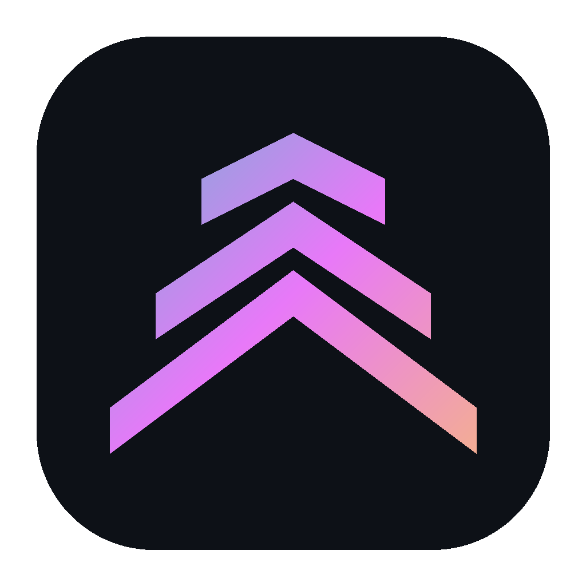

# Launchpad — Free Personalized Coding Education Platform



A free, privacy-first coding education platform with AI-powered personalized roadmaps, 164 lessons across 24 languages, a multi-language code playground, AI tutor, daily challenges, and certificates.

**Live URL:** https://launchpad--pi.vercel.app  
**GitHub:** https://github.com/dumzvybez/Launchpad  
**Developer:** Dumindu Dulara Wanasinghe ([Portfolio](https://dumindu-pi.vercel.app))

---

## ✨ Features

### 🧠 AI-Powered Personalization Engine
- **3-provider fallback chain:** Gemini 2.5 Flash → Groq Llama 3.3 70B → OpenRouter → deterministic engine
- **12-check validation** on AI-generated roadmaps
- Variable phase count (4-10) based on profile complexity
- AI bonus track (career-specific AI content) as second-to-last phase
- Lesson linking: roadmap tasks link directly to Learn tab lessons

### 📚 Learn Tab — 164 Lessons × 24 Technologies
Built from the canonical curriculum database:

| Technology | Lessons | | Technology | Lessons |
|-----------|---------|---|------------|---------|
| Python | 12 | | Go | 6 |
| JavaScript | 12 | | Rust | 6 |
| TypeScript | 8 | | Swift | 6 |
| HTML | 8 | | Kotlin | 6 |
| CSS | 8 | | PHP | 6 |
| SQL | 8 | | Ruby | 6 |
| Java | 6 | | R | 6 |
| C | 6 | | Dart | 6 |
| C++ | 6 | | Bash | 6 |
| C# | 6 | | React | 6 |
| Next.js | 6 | | Django | 6 |
| FastAPI | 6 | | Flask | 6 |

### 🤖 AI Tutor — Bring Your Own Key
6 providers supported:
- **Google Gemini** ⭐ (free tier)
- **Groq** ⭐ (free tier)
- **OpenRouter** ⭐ (free + paid)
- **OpenAI** (paid)
- **Anthropic** (paid)
- **Custom Endpoint** (OpenAI-compatible)

### 🧩 Multi-Language Code Playground
6 languages run in-browser: JavaScript, Python (Pyodide), SQL (sql.js), Lua (Fengari), Ruby (Opal), Bash (simulated)

### 📜 Certificates
- **Per-language certificate:** Complete all lessons + 75%+ average quiz score
- **Career Master Certificate:** 100% roadmap completion (40% tasks + 40% lessons + 20% projects)

### 🏅 24+ Achievements across 4 rarity tiers

### 🔒 100% On-Device Privacy
No accounts, no servers, no tracking. All data in localStorage.

---

## 🛠️ Tech Stack
- Next.js 16, TypeScript 5, Tailwind CSS 4, shadcn/ui, Zustand
- AI (Roadmap): Gemini → Groq → OpenRouter fallback chain
- AI (Chat): BYOK (Gemini, OpenAI, Anthropic, Groq, OpenRouter, Custom)
- Python execution: Pyodide (WebAssembly)

---

## 🚀 Getting Started

### Environment Variables
Create `.env.local`:
```env
GEMINI_API_KEY=your_key
GROQ_API_KEY=your_key
OPENROUTER_API_KEY=your_key
```
Get free keys: [Gemini](https://aistudio.google.com) · [Groq](https://console.groq.com) · [OpenRouter](https://openrouter.ai)

### Install
```bash
git clone https://github.com/dumzvybez/Launchpad.git
cd Launchpad
bun install
bun run dev
```

---

## 📄 License
MIT — free for personal and commercial use.
