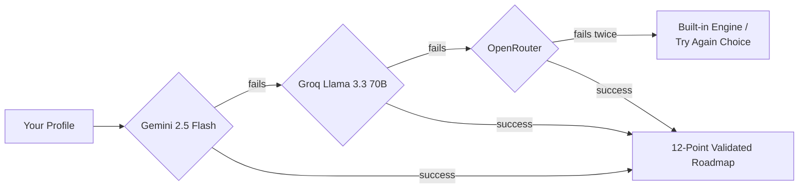
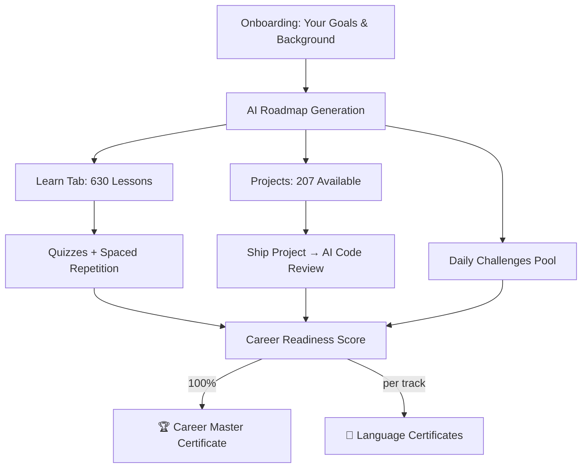

<div align="center">


# 🚀 Launchpad

### Free. Private. Personalized. Coding education the way it should be.

[](https://github.com/dumzvybez/Launchpad/discussions)
[](#-license)
[](https://launchpad--dev.vercel.app)
[](#-100-on-device-privacy)

**[🌐 Live App](https://launchpad--dev.vercel.app)** · **[💬 Discussions](https://github.com/dumzvybez/Launchpad/discussions)** · **[👨‍💻 Developer Portfolio](https://duminduwanasinghe-dev.vercel.app/)**

</div>

---

> ⚠️ **This project is actively under development.** Things are evolving fast, some features are still being polished, and your feedback genuinely shapes the roadmap. Jump into [Discussions](https://github.com/dumzvybez/Launchpad/discussions) to share ideas, report bugs, or just say hi.

## 🧭 What is Launchpad?

Launchpad is an AI-powered, personalized coding education platform built on one core belief: **learning to code shouldn't require an account, a subscription, or your data.**

Tell it your career goal, and Launchpad generates a custom learning roadmap pulling from a massive on-device curriculum — then walks with you through lessons, quizzes, projects, mock interviews, and even helps you build a resume at the end. All of it runs **100% in your browser.** No servers tracking you. No sign-ups. No catch.

<div align="center">

| | | | |
|:---:|:---:|:---:|:---:|
| **630** Lessons | **30** Languages | **207** Projects | **6,000** Quiz Questions |
| **1,860+** Daily Challenges | **25+** Badges | **600** Curated Videos | **0** Accounts Required |

</div>

---

## 📚 Table of Contents

- [✨ Core Features](#-core-features)
- [🧠 How the AI Personalization Works](#-how-the-ai-personalization-works)
- [🛠️ Tech Stack](#️-tech-stack)
- [🚀 Getting Started](#-getting-started)
- [📖 Course Catalog](#-course-catalog)
- [📜 Certificates](#-certificates)
- [🔒 Privacy, By Design](#-100-on-device-privacy)
- [🗺️ What's Next](#️-whats-next)
- [🤝 Contributing](#-contributing)
- [📄 License](#-license)

---

## ✨ Core Features

<details open>
<summary><strong>🧠 AI-Powered Roadmaps</strong></summary>
<br>

Your personalized learning path is generated through a resilient multi-provider AI chain — if one model is down, it quietly falls back to the next, and if everything fails, you can always continue on a deterministic built-in engine instead.



- 12-point validation on every AI-generated roadmap (phase counts, lesson references, sequencing, and more)
- Variable-length roadmaps (4–10 phases) that scale with your goals
- A dedicated AI-focused bonus phase near the end of every track
- Every roadmap task links straight into the matching lesson

</details>

<details>
<summary><strong>📚 Learn Tab — 630 Lessons Across 30 Technologies</strong></summary>
<br>

From Python and JavaScript to Rust, Swift, React, and PostgreSQL — each of the 30 tracks has 20 in-depth stages plus a capstone. Every single stage includes:

- A "why it matters" framing + prerequisites
- Multiple worked code examples
- Common pitfalls & real-world applications
- Collapsible interview questions
- A mini project + 10-question quiz with explanations
- A curated, privacy-respecting YouTube tutorial (youtube-nocookie.com)

</details>

<details>
<summary><strong>✏️ Inline Code Editor — Edit & Run Everywhere</strong></summary>
<br>

| Language type | How it runs |
|---|---|
| JavaScript / TypeScript | Sandboxed iframe, no `eval`, 5s timeout, network APIs stripped |
| HTML / CSS | Instant live preview |
| Python | Pyodide (Python via WebAssembly) |
| SQL | sql.js in-browser, with DB Fiddle for Postgres-specific features |
| Bash / Shell | Simulated shell with a fake virtual filesystem |
| Compiled languages (Java, C++, Go, Rust, etc.) | One-click launch into Replit / OneCompiler / official playgrounds |
| Frameworks (Svelte, Vue, Angular, Node) | Direct links to official playgrounds / StackBlitz |

</details>

<details>
<summary><strong>🤖 AI Tutor, Mock Interviews & Code Review (Bring Your Own Key)</strong></summary>
<br>

No platform-funded AI costs here — you plug in your own free or paid API key (Gemini, Groq, OpenRouter, OpenAI, Anthropic, or any custom OpenAI-compatible endpoint), and unlock:

- 💬 **AI Tutor** — full conversational help, multi-chat history, all stored on-device
- 🎯 **Mock Interview Mode** — a simulated senior technical interviewer asks questions one at a time, scores you, and tells you exactly what to study next
- 🔍 **AI Code Review** — paste shipped project code and get a structured review with a score out of 10

</details>

<details>
<summary><strong>📜 Certificates & Career Readiness</strong></summary>
<br>

- **Per-language certificates** unlock once you finish every lesson in a track and hit a 75%+ quiz average
- **Career Master Certificate** unlocks at a 100% Career Readiness Score — a weighted blend of roadmap progress, quiz performance, projects shipped, daily challenges, and interview practice
- Every certificate has a public, privacy-respecting verification page at `/verify/LP-XXXXXXXX`

</details>

<details>
<summary><strong>📄 Resume Builder, Progress Cards & Your Journey</strong></summary>
<br>

- One-click **resume auto-builder**, populated from your real Launchpad progress, exported as a PDF
- **Shareable progress cards** for LinkedIn, X, or Instagram
- A visual **"Zero to Hero" timeline** of every milestone you've hit, start to finish

</details>

<details>
<summary><strong>🎮 Gamification, Community & Daily Habits</strong></summary>
<br>

- 25+ badges and a 10-level XP curve that rewards lessons, quizzes, projects, streaks, and interviews
- **1,860+ daily challenges** across all 30 languages, rotating weekly
- A built-in **Community tab** (GitHub Discussions via Giscus) — Announcements, Help & Questions, Show & Tell, General Chat, and Feature Requests
- Calendar with recurring study sessions, reminders, and snooze support
- Installable as a PWA, with offline support and a mobile-first bottom nav

</details>

---

## 🧠 How the AI Personalization Works



---

## 🛠️ Tech Stack

| Layer | Technology |
|---|---|
| Framework | Next.js 16 (App Router) + TypeScript 5 |
| Styling | Tailwind CSS 4 + shadcn/ui (glass design system) |
| State | Zustand, persisted to `localStorage` |
| Roadmap AI | Gemini 2.5 Flash → Groq Llama 3.3 70B → OpenRouter (server-side fallback chain) |
| Tutor / Interview / Review AI | BYOK — Gemini, OpenAI, Anthropic, Groq, OpenRouter, or custom endpoint |
| Code Execution | Sandboxed iframe, Pyodide, sql.js, simulated shell |
| Community | Giscus (GitHub Discussions) |
| Syntax Highlighting | react-syntax-highlighter (Prism, vscDarkPlus) |

---

## 🚀 Getting Started

**1. Clone & install**

```bash
git clone https://github.com/dumzvybez/Launchpad.git
cd Launchpad
bun install
```

**2. Set up environment variables** — create `.env.local`:

```env
# Server-side only — used for roadmap generation, never exposed to the client
GEMINI_API_KEY=your_key
GROQ_API_KEY=your_key
OPENROUTER_API_KEY=your_key
```

Free keys: [Gemini](https://aistudio.google.com) · [Groq](https://console.groq.com) · [OpenRouter](https://openrouter.ai/keys)

> If all three keys are missing or every provider fails twice, you'll get a clean fallback screen — continue on the built-in engine or try again.

**3. Run it**

```bash
bun run dev
```

Then open **http://localhost:3000** 🎉

---

## 📖 Course Catalog

30 technologies × 21 lessons (20 stages + capstone) = **630 lessons total.**

<div align="center">

| | | | |
|---|---|---|---|
| Python | JavaScript | TypeScript | HTML |
| CSS | SQL | Java | C |
| C++ | C# | Go | Rust |
| Swift | Kotlin | PHP | Ruby |
| R | Dart | Bash | React |
| Next.js | Django | FastAPI | Flask |
| Svelte | Vue | Angular | Node.js |
| PostgreSQL | MongoDB | | |

</div>

Each track represents roughly **50–200 hours** of learning time, beginner to advanced.

---

## 📜 Certificates

| | Per-Language Certificate | Career Master Certificate |
|---|---|---|
| **Unlocks when** | All lessons in a track complete + 75%+ quiz average | 100% Career Readiness Score |
| **Format** | Landscape PDF, deterministic ID (`LP-XXXXXXXX`) | Gold-accented PDF, ID prefix `LP-CAREER-XXXXXXXX` |
| **Verification** | Public page at `/verify/LP-XXXXXXXX` | Same verification system |

---

## 🔒 100% On-Device Privacy

No accounts. No servers storing your data. No analytics. Everything lives in your browser's `localStorage`.

- Your AI API keys never leave your device
- Chat history with the AI Tutor stays local
- Roadmap generation sends only your stated goals to the AI provider — nothing else
- The Community tab requires a GitHub account to post, but your Launchpad progress is **never** shared there

---

## 🗺️ What's Next

This is a living project — here's what's actively being worked on or considered:

- Full spaced-repetition (SM-2) wiring across the quiz system
- A heavier Monaco-based code editor as an optional upgrade
- More in-browser SQL execution coverage
- Continued UI/UX polish across Notes & Calendar tabs
- Whatever the community asks for next 👇

Got an idea? Head to [Feature Requests](https://github.com/dumzvybez/Launchpad/discussions) — this roadmap is shaped by real feedback, not guesses.

---

## 🤝 Contributing

Pull requests, issues, and ideas are all welcome.

- **Repo:** [github.com/dumzvybez/Launchpad](https://github.com/dumzvybez/Launchpad)
- **Discussions:** [Share feedback, report bugs, request features](https://github.com/dumzvybez/Launchpad/discussions)
- **Developer:** Dumindu Dulara Wanasinghe — [Portfolio](https://duminduwanasinghe-dev.vercel.app/)

---

## 📄 License

MIT — free for personal and commercial use.

<div align="center">

**Built solo, built free, built for everyone learning to code.** 💙

</div>
